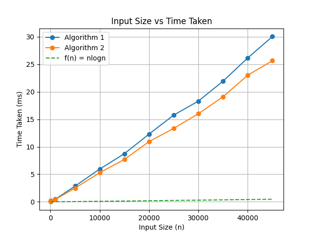
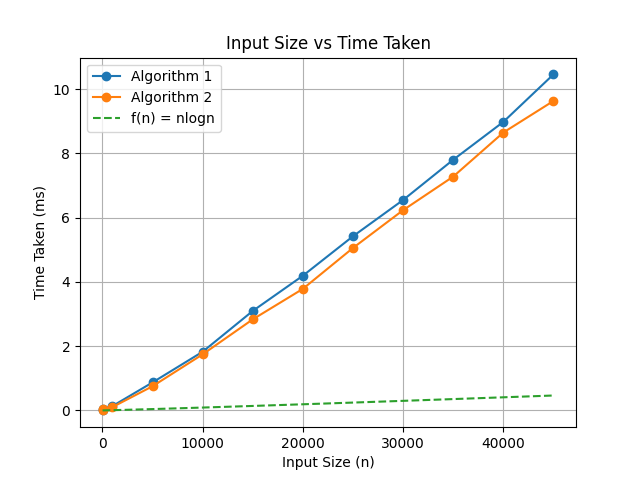
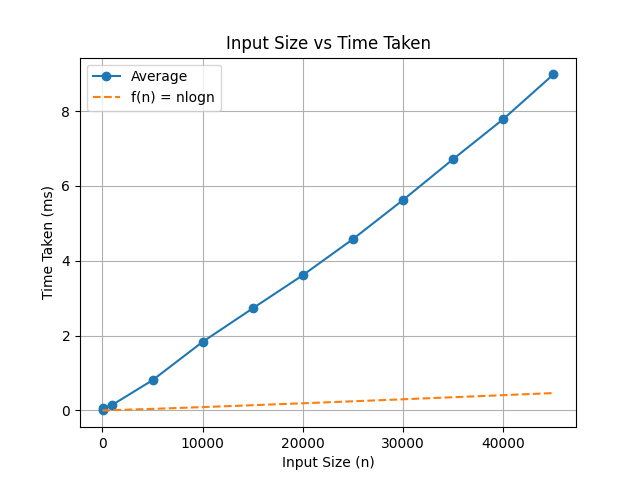
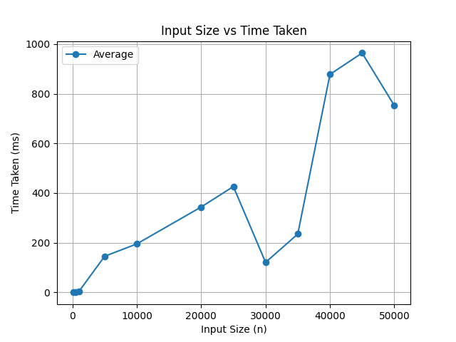
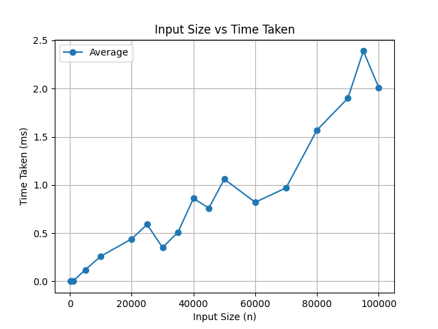
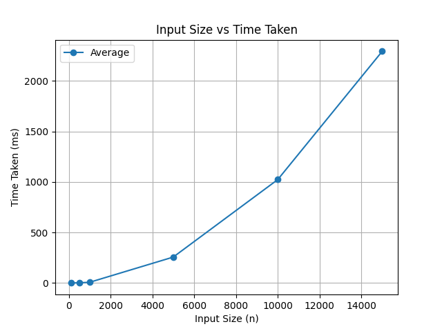
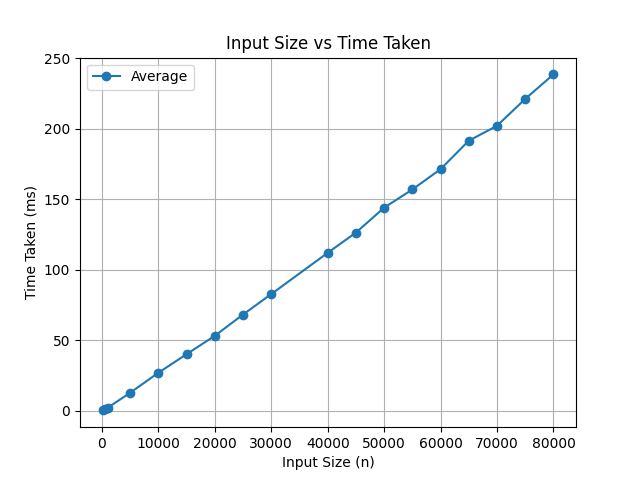

## PRACTICAL -1 
Aim
To implement the Bubble Sort algorithm and analyze the time taken to sort a list of numbers.

# Theory

Bubble Sort is a simple comparison-based sorting algorithm.
It works by repeatedly traversing the array and comparing adjacent elements.
If the elements are in the wrong order, they are swapped.

After each complete pass, the largest unsorted element “bubbles up” to its correct position at the end of the array.
This process continues until the entire array is sorted.

## GRAPH

## Time Complexity

Best Case: O(n) (when the array is already sorted, with optimization)

Average Case: O(n²)

Worst Case: O(n²)

## Space Complexity

O(1) (In-place sorting, no extra memory required)

## What the Code Does

This program sorts a list of randomly generated numbers using the Bubble Sort algorithm and measures the time taken.
The bubbleS(a) function implements the Bubble Sort logic.
It uses two nested loops to compare adjacent elements in the vector.
If an element is greater than the next element, they are swapped.
With each outer loop iteration, the largest element moves to the end of the array.
In the main() function, the number of elements is taken as input from the user.
Random numbers are generated and stored in a vector.
The sorting process is timed using the chrono library.
The program then displays the total time taken to sort the elements in milliseconds.
## Conclusion

Bubble Sort successfully sorts the array but is inefficient for large datasets due to its quadratic time complexity.
It is easy to understand and implement, making it suitable for learning purposes, but not recommended for performance-critical applications.

# PRACTICAL - 2

## Aim
To implement Horner’s method using recursion to represent a polynomial expression efficiently.

## Theory
Horner’s method is an efficient technique used to represent and evaluate polynomials.
It reduces the number of multiplications required by rewriting the polynomial in a nested form.

A polynomial of degree n − 1

can be rewritten using Horner’s method as:

This approach improves efficiency and simplifies polynomial evaluation.

## Time Complexity

O(n), where n is the number of coefficients

## Space Complexity

O(n) due to recursive function calls

## What the Code Does

This program prints the polynomial expression using Horner’s method through recursion.

The hornor(k, m, a) function recursively processes the coefficients of the polynomial stored in the vector a.
When the last coefficient is reached, it is printed and the recursion stops.

For each recursive call, the function prints an opening parenthesis and calls itself for the next coefficient.
After returning from recursion, it prints "x + " followed by the current coefficient and a closing parenthesis.

In the main() function, the number of coefficients is taken as input from the user.
The coefficients are stored in a vector and passed to the recursive function.

The output represents the polynomial in nested Horner’s form.

## Conclusion

Horner’s method provides an efficient way to represent and evaluate polynomials.
Using recursion, the polynomial is expressed in a clean and optimized nested format, reducing computational complexity compared to the standard polynomial form.

# PRACTICAL - 3
## Aim
To implement the Linear Search algorithm using recursion and measure the time taken to search for a key element.

## Theory
Linear Search is a simple searching algorithm that checks each element of the list sequentially until the desired element is found or the list ends.
In the recursive approach, the function compares the current element with the target value.
If a match is found, the index is returned.
Otherwise, the function calls itself for the next index.

This method is easy to understand but inefficient for large datasets.

## Time Complexity

Best Case: O(1) (key found at first position)
Average Case: O(n)
Worst Case: O(n)

## Space Complexity

O(n) due to recursive function calls

## What the Code Does

This program searches for a key element in a list of randomly generated numbers using recursive Linear Search.
The linearS(a, target, j) function recursively checks each element of the vector starting from index j.
If the index reaches the end of the vector, the function returns −1, indicating the key is not found.
If the current element matches the target, the index is returned.
Otherwise, the function calls itself with the next index.

In the main() function, the number of elements is taken as input from the user.
Random numbers are generated and stored in a vector.
A random key value is selected for searching.

The time taken for the search operation is measured using the chrono library and displayed in nanoseconds along with the index result.

## Conclusion

Linear Search successfully finds the target element if it exists in the list.
Although simple to implement, it is inefficient for large datasets due to its linear time complexity.
The recursive approach demonstrates the use of recursion in searching algorithms.

# PRACTICAL - 4

## Aim
To generate all possible permutations of a given string using recursion and backtracking.

## Theory
Permutation generation is the process of arranging the elements of a string in all possible orders.
For a string of length n, the total number of permutations is n!.

This program uses recursion with backtracking to generate permutations.
At each recursive step, the algorithm fixes one character and recursively permutes the remaining characters.
After each recursive call, the original order is restored using backtracking.

## Time Complexity

O(n!), where n is the number of characters

## Space Complexity

O(n) due to recursive call stack

## What the Code Does
This program generates and prints all permutations of a string entered by the user.

The permGen(a, k, n) function generates permutations recursively.
If k == n, a complete permutation is formed and printed.
Otherwise, the function iterates from index k to n − 1, swapping the current character with each subsequent character.

After each swap, the function calls itself for the next position (k + 1).
Once the recursive call returns, the characters are swapped back to restore the original order.
This backtracking step ensures all permutations are generated without duplication.
  In the main() function, the number of characters and the string are taken as input from the user.
  The recursive function is then called to display all possible permutations.

## Conclusion
The program successfully generates all permutations of a string using recursion and backtracking.
Although the algorithm is computationally expensive due to factorial time complexity, it is effective for small input sizes and demonstrates the concept of recursive backtracking clearly.

# PRACTICAL - 5
## Aim
To implement the Selection Sort algorithm and analyze the time taken to sort a list of numbers.

## Theory
Selection Sort is a simple comparison-based sorting algorithm.
It works by repeatedly selecting the smallest element from the unsorted portion of the array and placing it at the beginning.
In each pass, the algorithm finds the minimum element from the remaining unsorted elements and swaps it with the element at the current position.
This process continues until the entire array is sorted.

## GRAPH 

## Time Complexity

Best Case: O(n²)
Average Case: O(n²)
Worst Case: O(n²)

## Space Complexity

O(1) (In-place sorting algorithm)

## What the Code Does
This program sorts a list of randomly generated numbers using the Selection Sort algorithm and measures the time taken.

The selectionS(a) function implements the Selection Sort logic.
For each position i, the function assumes the element at index i is the minimum.
It then scans the remaining unsorted portion of the array to find the actual minimum element.

Once the smallest element is found, it is swapped with the element at index i.
This places the minimum element in its correct position after each iteration.

In the main() function, the number of elements is taken as input from the user.
Random numbers are generated and stored in a vector.
The time taken for the sorting operation is measured using the chrono library and displayed in nanoseconds.

## Conclusion
Selection Sort correctly sorts the array but is inefficient for large datasets due to its quadratic time complexity.
However, it performs fewer swaps compared to Bubble Sort and is useful for understanding basic sorting concepts.

# PRACTICAL -6 
## Aim
To solve the Tower of Hanoi problem using recursion and display the sequence of moves required to transfer the disks.

## Theory
The Tower of Hanoi is a classical problem that demonstrates the concept of recursion.
It consists of three pegs: source, destination, and auxiliary.

The objective is to move n disks from the source peg to the destination peg by following these rules:
Only one disk can be moved at a time.
A larger disk cannot be placed on top of a smaller disk.
An auxiliary peg can be used for intermediate moves.
The recursive solution breaks the problem into smaller subproblems until the base case is reached.

## Time Complexity

O(2ⁿ), where n is the number of disks
## Space Complexity

O(n) due to recursive call stack

## What the Code Does
This program prints the steps required to solve the Tower of Hanoi problem using recursion.
The TOH(n, src, dest, ext) function moves n disks from the source peg to the destination peg using an auxiliary peg.

If n == 1, the function directly moves the disk from the source to the destination.
Otherwise, it first moves n − 1 disks from the source peg to the auxiliary peg.
Then it moves the largest disk from the source peg to the destination peg.
Finally, it moves the n − 1 disks from the auxiliary peg to the destination peg.

In the main() function, the number of disks is taken as input from the user, and the recursive function is called to display all the moves.

## Conclusion
The Tower of Hanoi problem is efficiently solved using recursion by breaking it into smaller subproblems.
Although the number of moves grows exponentially, the problem clearly illustrates recursive thinking and divide-and-conquer strategy.

# PRACTICAL - 7
## Aim
To calculate the number of tips required to reduce a given value below a specified limit using recursion.

## Theory
This program demonstrates the use of recursion to repeatedly reduce a value by a fixed percentage until a stopping condition is met.
In each recursive call, the value is reduced by 42.5% of its current value.
The process continues until the value becomes less than 1.0.
A counter is maintained to keep track of the number of recursive calls (tips) required to reach the stopping condition.

## Time Complexity 
O(k), where k is the number of recursive reductions required

## Space Complexity
O(k) due to recursive call stack

## What the Code Does 
This program calculates how many times a value must be reduced by 42.5% until it becomes less than 1.0.

The findTips(v, tips) function checks if the current value v is greater than or equal to 1.0.
If true, the tip counter is incremented, and the value is reduced by 42.5% of its current value.
The function then calls itself with the updated value and tip count.

When the value becomes less than 1.0, the recursion stops and the total number of tips is returned.
In the main() function, the initial value is set to 40, and the recursive function is called.
The result is printed as the total number of tips required.

## Conclusion
The program successfully demonstrates the use of recursion for repetitive reduction problems.
It shows how recursive calls can be used to model real-world scenarios involving gradual decrease until a threshold is reached.

# Practical-8: Power of a Number
## Aim
To implement and compare two methods to calculate the value of a number raised to the power **n** using recursion.

## Theory
The optimized recursive method calculates the result by dividing the exponent into halves, which reduces the number of recursive calls.
The simple recursive method calculates the result by multiplying the base repeatedly until the exponent becomes zero.

## Time Complexity
- Optimized recursive method: O(log n)
- Simple recursive method: O(n)

## Space Complexity
- Optimized recursive method: O(log n)
- Simple recursive method: O(n)

## What the Code Does
This program calculates the power of a number using two different recursive approaches.

The **powerRec(x, n)** method uses a divide and conquer approach.  
If the exponent is zero, it returns **1**.  
If the exponent is negative, it converts it into a positive exponent.

The method recursively computes **x^(n/2)** and stores it in a variable.  
If the exponent is even, it multiplies the half result with itself.  
If the exponent is odd, it multiplies the result with **x** once more.

This approach is efficient and works well for large values of **n**.

The **powerRec2(x, n)** method is a simple recursive approach.  
It multiplies **x** with the result of the function called with **n − 1**.  
This process continues until the exponent becomes zero.
This method is easier to understand but slower for large values of **n**.

## Conclusion
Both methods correctly calculate the power of a number.  
The optimized recursive method is more efficient due to fewer recursive calls.

# PRACTICAL - 9
## Aim
To find the missing number in a sequence of consecutive integers using the XOR operation.

## Theory
Given an array containing n distinct numbers taken from the range 0 to n, one number is missing.
The XOR-based method efficiently identifies the missing number without using extra space.

Properties of XOR:
** a ^ a = 0 **
** a ^ 0 = a **

XOR is commutative and associative
Algorithm idea:

XOR all numbers from 0 to n.
XOR the result with all elements in the array.
The remaining value is the missing number, because all other numbers cancel out.

## Time Complexity
O(n), where n is the size of the array

## Space Complexity
O(1), constant extra space

## What the Code Does
This program finds the missing number in a given integer array using XOR.

The missingNum(nums) function:
XORs all numbers from 0 to n and stores the result in x.
XORs all elements in the input array with x.
Returns x, which now holds the missing number.

In the main() function, a vector of integers is defined (for example {0, 1, 2, 4}).
The function is called, and the missing number (3 in this case) is printed.

## Conclusion
The XOR method provides an efficient way to find the missing number using linear time and constant space.
It avoids sorting or extra arrays and demonstrates the power of bitwise operations in problem-solving.

## Practical-10 Duplicate number

## Aim 

To implement a C++ program that identifies a duplicate element in an array using a comparison-based approach.

## Theory

A duplicate element is a value that appears more than once in an array.
In this algorithm, the array is processed by comparing selected elements with other elements in the array to detect repetition.

The algorithm uses a simple nested loop technique:

The array size is divided to determine a comparison range.

A temporary element is selected.

This element is compared with other elements in the array.

If a match is found, that element is considered a duplicate.

This approach is easy to understand but not efficient for large datasets.

## Time Complexity

Best Case: O(n) (duplicate found early)
Average Case: O(n²)
Worst Case: O(n²) (duplicate found at the end)

## Space Complexity

O(1) (no extra memory used)

## What the Code Does

The program initializes an integer array containing duplicate values.
The function duplicate():

Divides the array size for comparison.

Selects a temporary element.

Compares it with other elements in the array.

Returns the duplicate element if found.

The main function:

Calculates the array size.

Calls the duplicate() function.

Prints the duplicate element.

Conclusion

The program successfully detects a duplicate element in the given array.
Although the logic is simple and easy to understand, the algorithm is inefficient for large inputs due to its quadratic time complexity.
This method is suitable only for small datasets or academic understanding.

## Practical-11: Binary Search (Recursive)
## Aim

To implement recursive binary search on a sorted array and measure its execution time.

## Theory

Binary Search is an efficient searching algorithm that works on a sorted array.
It repeatedly divides the search space into two halves and compares the target element with the middle element.
If the target equals the middle element, the search is successful.
If the target is smaller, the search continues in the left half.
If the target is larger, the search continues in the right half.
This divide-and-conquer approach significantly reduces the number of comparisons.

## GRAPH

## Time Complexity

Best Case: O(1)
Average Case: O(log n)
Worst Case: O(log n)

## Space Complexity

O(log n) (due to recursive call stack)

## What the Code Does

The program generates random numbers and stores them in a vector.
The array is shuffled and then sorted, which is required for binary search.
The largest element is chosen as the target.
The function binaryS() is called recursively:
If start > end, it returns -1 (element not found).
It calculates the middle index.
If the middle element matches the target, it returns the index.
Otherwise, it searches in the appropriate half.
The execution time is measured using the chrono library.
The array size and execution time are stored in binaryS.txt.

## Conclusion

Recursive Binary Search efficiently finds an element in a sorted array using fewer comparisons.
Its logarithmic time complexity makes it suitable for large datasets.

## Practical-12: Insertion Sort
## Aim

To implement the Insertion Sort algorithm and analyze its execution time.

## Theory

Insertion Sort is a simple sorting algorithm that works by inserting elements into their correct position in a sorted part of the array.
The array is divided into sorted and unsorted parts.
Elements from the unsorted part are picked one by one and placed at the correct position in the sorted part.
It is similar to sorting playing cards in hand.
Insertion Sort is easy to understand but inefficient for large inputs.

## GRAPH 

## Time Complexity

Best Case: O(n) (already sorted array)
Average Case: O(n²)
Worst Case: O(n²) (reverse sorted array)

## Space Complexity

O(1) (in-place sorting)

## What the Code Does

The program generates random elements and stores them in a vector.
The function insertionS() sorts the array:
It selects a key element.
Shifts all larger elements one position to the right.
Inserts the key at its correct position.
The execution time is measured using the chrono library.
The array size and execution time are written into insertionS.txt.

## Conclusion

Insertion Sort correctly sorts the array using a simple approach.
Although it is inefficient for large datasets, it is useful for small inputs and nearly sorted arrays.

## Practical-13: Merge Sort

### Aim
To implement the Merge Sort algorithm and analyze its execution time.

### Theory
Merge Sort is a **divide-and-conquer** sorting algorithm.  
It works by recursively dividing the array into smaller subarrays, sorting them, and then merging them back together.

The process involves:
- Dividing the array into two halves
- Recursively sorting each half
- Merging the sorted halves into a single sorted array

Unlike simple sorting algorithms, Merge Sort is efficient for large datasets due to its logarithmic division strategy.

### Graph

### Time Complexity

| Case        | Complexity   |
|------------|-------------|
| Best Case   | O(n log n)  |
| Average Case| O(n log n)  |
| Worst Case  | O(n log n)  |

### Space Complexity
- O(n) (requires additional space for merging)

### What the Code Does

- The program generates arrays of different sizes.
- Each array is filled with sequential values and then shuffled randomly.
- The `mergeSort()` function:
  - Recursively divides the array into halves
  - Calls `merge()` to combine sorted subarrays
- The `merge()` function:
  - Compares elements from two halves
  - Merges them into a temporary vector in sorted order
- The sorting process is repeated **1000 times** for each input size to calculate average execution time.
- Execution time is measured using the `chrono` library.
- The program outputs the **average time (in milliseconds)** for each input size.

---

### Conclusion
Merge Sort efficiently sorts large datasets with a guaranteed time complexity of **O(n log n)**.  
Although it requires extra memory, it is significantly faster and more stable compared to algorithms like Insertion Sort for large inputs.

## Practical-14: Quick Sort

### Aim
To implement the Quick Sort algorithm and analyze its execution time.

---

### Theory
Quick Sort is a **divide-and-conquer** sorting algorithm.  
It works by selecting a **pivot element** and partitioning the array such that:
- Elements smaller than the pivot are placed on the left
- Elements greater than the pivot are placed on the right

The process is then recursively applied to the left and right subarrays.

In this implementation, the pivot is chosen as the **middle element**, and elements are rearranged around it using a custom partitioning approach.

---

### Graph

---

### Time Complexity

 Case          Complexity   
 Best Case :    O(n log n)  
 Average Case : O(n log n)  
 Worst Case  :  O(n²)       

---

### Space Complexity
- O(log n) (due to recursion stack)

---

### What the Code Does

- The program generates arrays of different sizes.
- Each array is filled with sequential values and then shuffled randomly.
- The `quickSort()` function:
  - Selects a pivot using the `partitionFunc()`
  - Recursively sorts elements before and after the pivot
- The `partitionFunc()`:
  - Chooses the middle element as pivot
  - Places the pivot at its correct position
  - Rearranges elements such that smaller elements are on the left and larger on the right
- The sorting process is repeated **1000 times** for each input size to compute average execution time.
- Execution time is measured using the `chrono` library.
- The program outputs the **average time (in milliseconds)** for each input size.

---

### Conclusion
Quick Sort is one of the fastest sorting algorithms in practice due to its efficient partitioning strategy.  
However, its worst-case complexity is **O(n²)**, which can occur when poor pivot choices are made.  
Despite this, it performs exceptionally well on average and is widely used in real-world applications.

## Practical-15: Binary Search

### Aim
To implement the Binary Search algorithm and analyze its execution time.

---

### Theory
Binary Search is an efficient searching algorithm that works on **sorted arrays**.  
It repeatedly divides the search space into smaller parts by comparing the target element with the middle element.

Steps involved:
- Find the middle element of the array
- If the target matches the middle element, return the index
- If the target is smaller, search in the left half
- If the target is larger, search in the right half

This process continues until the element is found or the search space becomes empty.

---

### Time Complexity

 Case          Complexity 
 Best Case  :   O(1)      
 Average Case : O(log n)  
 Worst Case  :  O(log n)  

---

### Space Complexity
- O(log n) (due to recursion stack)

---

### What the Code Does

- The program generates arrays of different sizes.
- Each array is initially filled with sequential values.
- The array is then shuffled randomly.
- A target element is selected from the array.
- The `binaryS()` function:
  - Recursively searches for the target element
  - Divides the array into smaller parts based on comparison
- The searching process is repeated **1000 times** for each input size to calculate average execution time.
- Execution time is measured using the `chrono` library.
- The program outputs the **average time (in milliseconds)** for each input size.

---

### Conclusion
Binary Search is a highly efficient searching algorithm with **O(log n)** time complexity.  
It significantly reduces the number of comparisons compared to linear search.  
However, it requires the data to be **sorted**, which is a key limitation.

## Practical-16: Iterative Quick Sort 

### Aim
To implement the Quick Sort algorithm using an iterative approach (without recursion) and analyze its execution time.

---

### Theory
Iterative Quick Sort is a variation of the Quick Sort algorithm that eliminates recursion by using an explicit **stack** data structure.

Instead of recursive function calls:
- A stack is used to store subarray indices
- The algorithm processes subarrays iteratively

Steps involved:
- Push the initial range (start and end indices) onto the stack
- Pop a range and partition it around a pivot
- Push left and right subarrays (if valid) back onto the stack
- Repeat until the stack becomes empty

This approach avoids recursion overhead and helps prevent stack overflow for large inputs.

---

### Graph

---

### Time Complexity

 Case          Complexity   
 Best Case   :  O(n log n)  
 Average Case : O(n log n)  
 Worst Case  :  O(n²)       

---

### Space Complexity
- O(log n) (stack space in average case)
- O(n) (worst case when stack grows large)

---

### What the Code Does

- The program generates arrays of different sizes.
- Each array is filled with sequential values and then shuffled randomly.
- The `quickSort()` function:
  - Uses a stack to simulate recursion
  - Stores subarray indices (low and high)
  - Iteratively processes subarrays
- The `partition()` function:
  - Selects the first element as pivot
  - Rearranges elements such that smaller elements are on the left and larger on the right
- The sorting process is repeated **1000 times** for each input size to compute average execution time.
- Execution time is measured using the `chrono` library.
- The program outputs the **average time (in milliseconds)** for each input size.

---

### Conclusion
Iterative Quick Sort successfully eliminates recursion by using a stack-based approach.  
It provides similar performance to recursive Quick Sort while avoiding recursion-related overhead and potential stack overflow issues.  
However, its worst-case time complexity remains **O(n²)** when poor pivot choices are made.

## Practical-17: Convex Hull 

### Aim
To implement the Convex Hull algorithm  and analyze its execution.

---

### Theory
The Convex Hull of a set of points is the smallest convex polygon that encloses all given points.

The Monotonic Chain algorithm (Andrew’s Algorithm) is an efficient method to compute the convex hull in O(n log n) time.

Steps involved:
- Sort all points based on x-coordinate (and y if tie)
- Build the lower hull by traversing left to right
- Build the upper hull by traversing right to left
- Remove duplicate points
- Combine both hulls to form the final convex hull

### Time Complexity

 Case     :     Complexity 
 Best Case   :   O(n log n) 
 Average Case : O(n log n) 
 Worst Case  :  O(n log n) 

---

### Space Complexity
- O(n) for storing hull points

---

### What the Code Does

- The program takes a set of 2D points as input.
- Points are sorted based on their coordinates.
- The `orientation()` function determines the turn direction of three points.
- The `convexHull()` function:
  - Builds the lower hull
  - Builds the upper hull
  - Removes unnecessary points that do not form a convex boundary
- Both hulls are merged to produce the final convex hull.
- The program outputs the points forming the convex boundary.

### Conclusion
The Monotonic Chain algorithm efficiently computes the convex hull with O(n log n) time complexity.  
It is simple to implement and works well for large datasets.  
It avoids unnecessary computations by constructing the hull using geometric properties.

## Practical-18: Fractional Knapsack 

### Aim
To implement the Fractional Knapsack algorithm using a greedy approach and analyze its execution time.

---

### Theory
The Fractional Knapsack problem is an optimization problem where the goal is to maximize total value within a given capacity.

Unlike the 0/1 Knapsack:
- Items **can be broken into fractions**
- You can take a portion of an item instead of the whole

Greedy strategy:
- Compute **value-to-weight ratio (value/weight)** for each item
- Sort items in **descending order of ratio**
- Pick items greedily:
  - Take full item if capacity allows
  - Otherwise, take fractional part

---

### Time Complexity

 Case         Complexity  
 Best Case  :  O(n log n)  
 Average Case : O(n log n)  
 Worst Case  :  O(n log n)  

---

### Space Complexity
- O(n) (for storing items)

---

### What the Code Does

- The program generates random items:
  - Each item has a **value** and a **weight**
- The `generateItems()` function:
  - Creates `n` items with random values and weights
- The `bubbleS()` function:
  - Sorts items based on **value-to-weight ratio** in descending order
- The `knapSack()` function:
  - Iterates through sorted items
  - Adds full item if capacity allows
  - Otherwise adds fractional value of remaining capacity
- The process is repeated **50 times** for each input size to calculate average execution time
- Execution time is measured using the `chrono` library
- The program outputs the **average time (in milliseconds)** for each input size

---

### Conclusion
The Fractional Knapsack algorithm efficiently maximizes value using a greedy approach.  
It performs well due to sorting based on value-to-weight ratio and allows partial selection of items.  
This makes it significantly more efficient than the 0/1 Knapsack for large datasets.

## Practical-19: Kth Smallest Element 

### Aim
To find the Kth smallest element in an array using the Quickselect algorithm and analyze its execution time.

---

### Theory
Quickselect is an efficient selection algorithm based on the **Quick Sort partitioning technique**.  
It is used to find the Kth smallest (or largest) element in an unsorted array without fully sorting it.

Steps involved:
- Choose a pivot element
- Partition the array such that:
  - Elements smaller than pivot are on the left
  - Elements larger than pivot are on the right
- Check the position of the pivot:
  - If it is the Kth position → return it
  - If it is smaller → search in the right subarray
  - If it is larger → search in the left subarray

This reduces unnecessary computations compared to full sorting.

---

### Graph

---

### Time Complexity

 Case          Complexity   
 Best Case   :   O(n)        
 Average Case : O(n)        
 Worst Case  :  O(n²)       

---

### Space Complexity
- O(1) (in-place algorithm)

---

### What the Code Does

- The program generates arrays of different sizes.
- The `generateArray()` function:
  - Creates a unique array of elements from `1` to `n`
  - Randomly shuffles the array
- The user inputs the value of **K**.
- The `ksmallest()` function:
  - Uses an iterative Quickselect approach
  - Partitions the array and narrows down the search space
- The `partition()` function:
  - Selects the first element as pivot
  - Rearranges elements around the pivot
- The process is repeated **100 times** for each input size to compute average execution time.
- Execution time is measured using the `chrono` library in **microseconds**.
- The program outputs the **average time** for each input size.

---

### Conclusion
Quickselect efficiently finds the Kth smallest element without sorting the entire array.  
It has an average time complexity of **O(n)**, making it faster than sorting-based approaches for selection problems.  
However, its worst-case complexity is **O(n²)** when poor pivot choices are made.

## Practical-20: Find Maximum and Minimum 

### Aim
To find the maximum and minimum elements in an array using the Divide and Conquer approach and analyze its execution time.

---

### Theory
The Divide and Conquer approach breaks the problem into smaller subproblems, solves them independently, and combines their results.

Steps involved:
- Divide the array into two halves
- Recursively find maximum and minimum in each half
- Compare results from both halves to get final maximum and minimum

Cases handled:
- If only one element → both max and min are the same
- If two elements → compare directly
- Otherwise → divide and solve recursively

This approach reduces the number of comparisons compared to a simple linear scan.

---

### Graph

---

### Time Complexity

 Case          Complexity 
 Best Case  :  O(n)      
 Average Case : O(n)      
 Worst Case  :  O(n)      

---

### Space Complexity
- O(log n) (due to recursion stack)

---

### What the Code Does

- The program generates arrays of different sizes.
- The `generateArray()` function:
  - Creates a unique array of elements from `1` to `n`
  - Randomly shuffles the array
- The `maxMin()` function:
  - Uses divide and conquer to find maximum and minimum values
  - Splits the array recursively into smaller parts
  - Combines results from subarrays
- The process is repeated **100 times** for each input size to compute average execution time.
- Execution time is measured using the `chrono` library.
- The program outputs the **average time (in milliseconds)** for each input size.

---

### Conclusion
The Divide and Conquer approach efficiently finds both maximum and minimum elements with fewer comparisons than a naive approach.  
It maintains a linear time complexity of **O(n)** and performs well for large datasets.

## Practical-21: Dijkstra’s Algorithm 

### Aim
To implement Dijkstra’s algorithm to find the shortest path from a source vertex to all other vertices in a graph and analyze its execution time.

---

### Theory
Dijkstra’s Algorithm is a **greedy algorithm** used to find the shortest path in a graph with **non-negative edge weights**.

Steps involved:
- Initialize distances from the source to all vertices as infinity
- Set distance of source vertex to 0
- Select the unvisited vertex with the smallest distance
- Update distances of its neighboring vertices
- Mark the vertex as visited
- Repeat until all vertices are processed

This implementation uses an **adjacency matrix** and a simple linear search to find the minimum distance vertex.

---

### Graph

---

### Time Complexity

 Case          Complexity 
 Best Case   :  O(n²)     
 Average Case : O(n²)     
 Worst Case  :  O(n²)     

---

### Space Complexity
- O(n²) (adjacency matrix)
- O(n) (distance and visited arrays)

---

### What the Code Does

- The program generates graphs of different sizes using an adjacency matrix.
- The `generateMatrix()` function:
  - Creates a random weighted graph
  - Assigns random weights or `INF` (no edge) between vertices
- The `dijkastra()` function:
  - Initializes distance and visited arrays
  - Repeatedly selects the vertex with minimum distance
  - Updates distances of adjacent vertices
- The `minDist()` function:
  - Finds the unvisited vertex with the smallest distance
- The process is repeated **20 times** for each input size to compute average execution time.
- Execution time is measured using the `chrono` library.
- The program outputs the **average time (in milliseconds)** for each input size.

---

### Conclusion
Dijkstra’s Algorithm efficiently computes shortest paths from a source node in graphs with non-negative weights.  
Although this implementation has **O(n²)** complexity due to the adjacency matrix and linear search, it is simple and effective for dense graphs.  
Using advanced data structures like **priority queues (min-heaps)** can further optimize the performance to **O((V + E) log V)**.

## Practical-22: Prim’s Algorithm 

### Aim
To implement Prim’s algorithm to find the Minimum Spanning Tree (MST) of a graph and analyze its execution time.

---

### Theory
Prim’s Algorithm is a **greedy algorithm** used to find the Minimum Spanning Tree of a connected, weighted, undirected graph.

A Minimum Spanning Tree is a subset of edges that:
- Connects all vertices
- Has no cycles
- Has the minimum possible total edge weight

Steps involved:
- Start from any vertex (source)
- Select the minimum weight edge connecting a visited vertex to an unvisited vertex
- Add the selected edge to the MST
- Repeat until all vertices are included

This implementation uses a **priority queue (min-heap)** to efficiently select the next minimum edge.

---

### Graph

---

### Time Complexity

 Case          Complexity           
 Best Case   :   O(E log V)           
 Average Case : O(E log V)           
 Worst Case  :  O(E log V)           

---

### Space Complexity
- O(V + E) (adjacency list)
- O(V) (MST set and priority queue)

---

### What the Code Does

- The program generates graphs of different sizes using adjacency lists.
- The `generateGraph()` function:
  - Creates a random undirected weighted graph
  - Assigns random weights between vertices
- The `primAlgo()` function:
  - Uses a priority queue (min-heap) to pick the smallest edge
  - Maintains a visited array (`mstSet`)
  - Adds edges to the MST while avoiding cycles
- The process is repeated **50 times** for each graph size to compute average execution time.
- Execution time is measured using the `chrono` library.
- The program outputs the **average time (in milliseconds)** for each input size.

---

### Conclusion
Prim’s Algorithm efficiently constructs a Minimum Spanning Tree using a greedy approach.  
With the use of a priority queue, it achieves a time complexity of **O(E log V)**, making it suitable for large and sparse graphs.  
It is widely used in network design, routing, and optimization problems.

## Practical-23: Kruskal’s Algorithm

### Aim
To implement Kruskal’s Algorithm to find the Minimum Spanning Tree (MST) of a graph.

---

### Theory
A Minimum Spanning Tree (MST) is a subset of edges in a weighted graph that:
- Connects all vertices
- Has no cycles
- Has the minimum possible total edge weight

Kruskal’s Algorithm is a greedy algorithm that:
- Selects edges in increasing order of weight
- Adds an edge only if it does not form a cycle

Steps involved:
- Sort all edges in increasing order of weight
- Pick the smallest edge
- Check if it forms a cycle
- If no cycle → include it in MST
- Repeat until (V - 1) edges are selected

---

### Time Complexity

 Case          Complexity 
 Best Case   :   O(E log E) 
 Average Case : O(E log E) 
 Worst Case  :  O(E log E) 

---

### Space Complexity
- O(V + E)

---

### What the Code Does

- The program defines an `edge` structure with source, destination, and weight.
- A min-heap (priority queue) is used to always pick the smallest edge.
- The `isCycle()` function:
  - Uses DFS to detect if adding an edge creates a cycle
- The `kruskal()` function:
  - Extracts edges from the min-heap
  - Checks for cycles
  - Adds valid edges to MST
  - Keeps track of total cost
- The algorithm stops when (V - 1) edges are added.

---

### Key Concept

Cycle detection using DFS:
- Before adding an edge (u, v), check if a path already exists between u and v.
- If yes → adding edge creates cycle → reject it.

---

### Output

- Prints edges included in MST
- Displays total minimum cost

---

### Conclusion
Kruskal’s Algorithm efficiently finds the Minimum Spanning Tree using a greedy approach.  
It ensures minimum total cost while avoiding cycles.  
However, cycle detection using DFS is less efficient compared to Union-Find, which is preferred for large graphs.

---

## Practical-24: Matrix Chain Multiplication 

### Aim
To determine the most efficient way to multiply a chain of matrices using Dynamic Programming and minimize the number of scalar multiplications.

---

### Theory
Matrix Chain Multiplication (MCM) is an optimization problem that determines the best way to multiply a sequence of matrices.

Key idea:
- Matrix multiplication is **associative**, meaning the order of multiplication can be changed
- However, different orders result in **different computational costs**

Steps involved:
- Break the problem into smaller subproblems
- Compute minimum multiplication cost for each subchain
- Store results in a table to avoid recomputation (Dynamic Programming)
- Reconstruct the optimal parenthesization

---

### Time Complexity

 Case          Complexity 
 Best Case   :   O(n³)     
 Average Case : O(n³)     
 Worst Case  :  O(n³)     

---

### Space Complexity
- O(n²) (for cost and split tables)

---

### What the Code Does

- The program defines an array `p[]` representing matrix dimensions
  - If there are `n` matrices, the array size is `n+1`
- The `MCM()` function:
  - Uses Dynamic Programming to compute minimum multiplication cost
  - Stores results in matrix `m[][]`
  - Stores optimal split positions in matrix `s[][]`
- The `printParenthesis()` function:
  - Recursively prints the optimal parenthesization of matrices
- The program outputs:
  - Minimum number of scalar multiplications
  - Optimal order of multiplication

---

### Conclusion
Matrix Chain Multiplication efficiently determines the optimal order of matrix multiplication using Dynamic Programming.  
It reduces redundant computations and ensures the minimum number of operations with a time complexity of **O(n³)**.  
This approach is widely used in compiler optimization and mathematical computations.

## Practical-25: Multistage Graph 

### Aim
To find the minimum cost path in a multistage graph using forward and backward dynamic programming approaches.

---

### Theory
A Multistage Graph is a directed acyclic graph (DAG) divided into multiple stages, where:
- Each node belongs to a specific stage
- Edges exist only from one stage to the next

The goal is to find the **minimum cost path** from the source (first stage) to the destination (last stage).

Two approaches are used:

#### Forward Approach
- Start from the destination node
- Move backward stage by stage
- Compute minimum cost to reach the destination

#### Backward Approach
- Start from the source node
- Move forward stage by stage
- Compute minimum cost to reach each node

Both approaches use **Dynamic Programming** to store intermediate results and avoid recomputation.

---

### Time Complexity

 Case         Complexity 
 Best Case   :   O(n²)     
 Average Case : O(n²)     
 Worst Case  :  O(n²)     

---

### Space Complexity
- O(n²) (cost matrix)
- O(n) (cost and decision arrays)

---

### What the Code Does

- The program takes the number of vertices as input.
- A random cost adjacency matrix is generated:
  - Only forward edges are allowed (upper triangular matrix)
  - Some edges are assigned zero (no connection)
- The `findStages()` function:
  - Determines the number of stages in the graph
- The `forwardGraph()` function:
  - Computes minimum cost from source to destination using backward traversal
- The `backwardGraph()` function:
  - Computes minimum cost from source using forward traversal
- The program outputs:
  - Generated cost matrix
  - Minimum cost using forward approach
  - Minimum cost using backward approach

---

### Conclusion
The Multistage Graph approach efficiently solves shortest path problems in staged graphs using Dynamic Programming.  
Both forward and backward methods provide optimal solutions while reducing redundant calculations.  
This technique is widely used in scheduling, resource allocation, and decision-making problems.

## Practical-26: All-Pairs Shortest Path

### Aim
To implement the Floyd–Warshall algorithm to find the shortest paths between all pairs of vertices in a graph.

---

### Theory
The All-Pairs Shortest Path problem finds the shortest distance between every pair of vertices in a graph.

The Floyd–Warshall algorithm is a dynamic programming approach that:
- Considers each vertex as an intermediate node
- Updates shortest paths by checking if a shorter path exists via that node

Steps involved:
- Initialize the distance matrix
- For each vertex k:
  - Update all pairs (i, j)
  - Check if path i → k → j is shorter than i → j
- Repeat for all vertices

### Time Complexity

| Case         | Complexity |
|-------------|-----------|
| Best Case    | O(n³) |
| Average Case | O(n³) |
| Worst Case   | O(n³) |

---

### Space Complexity
- O(n²) for distance matrix

---

### What the Code Does

- The program initializes a graph using an adjacency matrix.
- `INF` represents no direct path between nodes.
- The `allpairShort()` function:
  - Uses three nested loops
  - Updates shortest distances using intermediate nodes
- The algorithm gradually improves all shortest paths.
- The final matrix shows shortest distances between every pair of vertices.

---

### Key Formula
- d[i][j] = min(d[i][j], d[i][k] + d[k][j])

### Conclusion
The Floyd–Warshall algorithm successfully computes the shortest paths between all pairs of vertices in a graph using a dynamic programming approach.  
It systematically improves the distance matrix by considering each vertex as an intermediate node.  
Although its time complexity is O(n³), it is simple to implement and effective for dense graphs.

## Practical-27: Longest Common Subsequence (LCS)

### Aim
To implement the Longest Common Subsequence (LCS) algorithm using Dynamic Programming and print the subsequence.

---

### Theory
The Longest Common Subsequence (LCS) problem is to find the longest subsequence common to two sequences.

A subsequence:
- Maintains the order of elements
- Does not require elements to be contiguous

Dynamic Programming is used to:
- Break the problem into smaller subproblems
- Store results in a table to avoid recomputation

The algorithm builds a table that stores lengths of LCS for substrings and then reconstructs the sequence.

---

### Algorithm

1. Start
2. Input two strings X and Y
3. Let m = length of X, n = length of Y
4. Create two tables:
   - c[m+1][n+1] for lengths
   - p[m+1][n+1] for path tracking
5. Initialize first row and column with 0
6. For i from 1 to m:
   - For j from 1 to n:
     - If X[i-1] == Y[j-1]:
       c[i][j] = 1 + c[i-1][j-1]
       p[i][j] = 'D'
     - Else if c[i-1][j] >= c[i][j-1]:
       c[i][j] = c[i-1][j]
       p[i][j] = 'U'
     - Else:
       c[i][j] = c[i][j-1]
       p[i][j] = 'L'
7. LCS length = c[m][n]
8. Use recursive function to print LCS using table p
9. Stop

---

### Time Complexity

| Case         | Complexity |
|-------------|-----------|
| Best Case    | O(m × n) |
| Average Case | O(m × n) |
| Worst Case   | O(m × n) |

---

### Space Complexity
- O(m × n) for DP tables

---

### What the Code Does

- The program takes two input strings.
- It builds a DP table to store lengths of common subsequences.
- A direction table is maintained to reconstruct the sequence.
- The LCS length is printed from the table.
- The actual LCS is printed using recursion.

---

### Key Formula
c[i][j] = 1 + c[i-1][j-1]   (if characters match)  
c[i][j] = max(c[i-1][j], c[i][j-1])   (otherwise)

---

### Conclusion
The Longest Common Subsequence problem is efficiently solved using Dynamic Programming.
The algorithm computes the length of the longest subsequence and reconstructs it using a direction table.
Although the time complexity is O(m × n), it is practical and widely used in applications like DNA sequence analysis and text comparison.

## Practical-28: 0/1 Knapsack using Dynamic Programming

### Aim
To implement the 0/1 Knapsack problem using Dynamic Programming and analyze its execution time.

---

### Theory
The 0/1 Knapsack problem is a classic optimization problem where we are given:
- A set of items, each with a weight and value
- A knapsack with a fixed capacity

The objective is to maximize the total value such that the total weight does not exceed the capacity.

In 0/1 Knapsack:
- Each item can either be included (1) or excluded (0)
- Fractional selection is not allowed

Dynamic Programming is used to:
- Break the problem into smaller subproblems
- Store intermediate results to avoid recomputation

---
### Graph 
---

### Algorithm

1. Start
2. Input number of items n and capacity W
3. Initialize DP table dp[n+1][W+1] with 0
4. For each item i from 1 to n:
   - For each capacity w from 1 to W:
     - If wt[i-1] <= w:
       dp[i][w] = max(val[i-1] + dp[i-1][w - wt[i-1]], dp[i-1][w])
     - Else:
       dp[i][w] = dp[i-1][w]
5. Store result in dp[n][W]
6. Repeat for multiple runs to calculate average execution time
7. Print average time for each input size
8. Stop

---

### Time Complexity

| Case         | Complexity |
|-------------|-----------|
| Best Case    | O(n × W) |
| Average Case | O(n × W) |
| Worst Case   | O(n × W) |

---

### Space Complexity
- O(n × W) for DP table

---

### What the Code Does

- The program generates random weights and values for items.
- It uses a DP table to compute the maximum achievable value.
- The knapsack() function uses a bottom-up dynamic programming approach.
- The algorithm is executed multiple times for each input size.
- Execution time is measured using the chrono library.
- The average time for each input size is printed.

---

### Key Formula
dp[i][w] = max(val[i-1] + dp[i-1][w - wt[i-1]], dp[i-1][w])

---

### Conclusion
The 0/1 Knapsack problem is efficiently solved using Dynamic Programming by storing intermediate results in a table.
The algorithm guarantees an optimal solution but has pseudo-polynomial time complexity O(n × W), as it depends on both number of items and capacity.
The experimental results show that execution time increases as input size and capacity increase.

